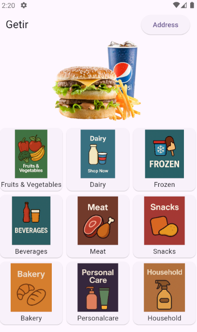

# Simple Market App with Flutter

This is a basic market application developed with Flutter. It features a homepage similar to Getir's interface, showcasing product categories, banner carousel, and navigation to different product sections.

## 🛠 Features

- 🛒 Category grid (Fruits, Dairy, Drinks, Snacks, etc.)
- 🎠 Banner carousel slider at the top
- 📍 Address selection and update pages
- 📦 Navigation to different product pages (food, drinks, personal care)
- 📁 Well-structured and modular folder organization

## 📂 Project Structure

```
lib/
├── data/
│   └── entity/
│       ├── addressInformation.dart
│       ├── drinksInformation.dart
│       ├── foodsInformation.dart
│       ├── generalNeedInformation.dart
│       └── menuInformation.dart
├── ui/
│   └── views/
│       ├── addressPage.dart
│       ├── detailAddressPage.dart
│       ├── drinksPage.dart
│       ├── foodsPage.dart
│       ├── generalNeed.dart
│       ├── mainPage.dart
│       └── updateAddressPage.dart
└── main.dart
```

## 📷 Screenshot Preview

Below is a preview of the main page layout:



## 🚀 Getting Started

To run this project on your machine:

1. Clone the repository:
   ```
   git clone https://github.com/your-username/simple-market-app-flutter.git
   ```

2. Navigate into the project directory:
   ```
   cd simple-market-app-flutter
   ```

3. Install the dependencies:
   ```
   flutter pub get
   ```

4. Run the app:
   ```
   flutter run
   ```

## 📦 Dependencies

- `flutter`
- `carousel_slider`

## 📄 License

This project is licensed under the MIT License.


## Getting Started

This project is a starting point for a Flutter application.

A few resources to get you started if this is your first Flutter project:

- [Lab: Write your first Flutter app](https://docs.flutter.dev/get-started/codelab)
- [Cookbook: Useful Flutter samples](https://docs.flutter.dev/cookbook)

For help getting started with Flutter development, view the
[online documentation](https://docs.flutter.dev/), which offers tutorials,
samples, guidance on mobile development, and a full API reference.
